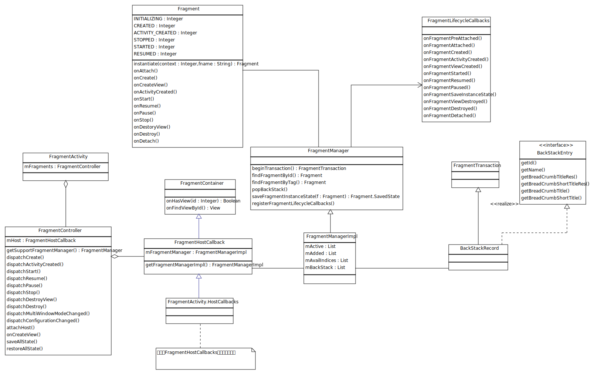
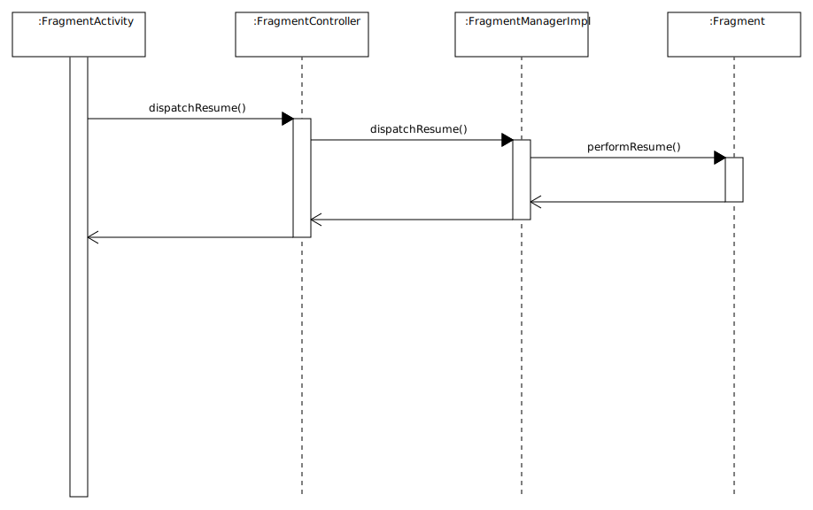
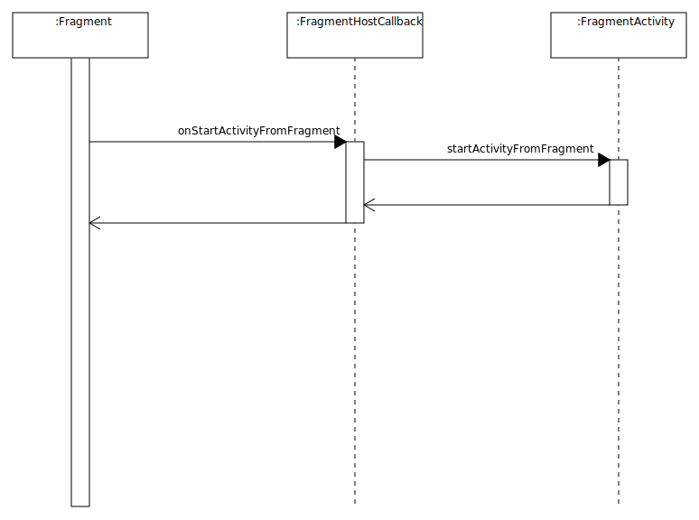

# Fragment源码分析
由于Fragment的独立性和灵活性，在App中拥有广泛的使用。然而，如果使用不当就会造成一些奇怪的BUG发生。本文将对Fragment源码进行分析，从而更好的理解Fragment的使用。由于笔者水平有限，分析的不正确之处还望指出。

## 本文主要分析的内容
- Fragment的使用
- Activity与Fragment之间的通信
- 一次Transaction发生了什么
- Actvity与Framgent生命周期的关联
- Fragment的恢复机制
- Fragment中的一些细节
- FragmentPagerAdapter是如何工作的

## 本文不会涉及到的内容

- Transition
- Fragment与Loader
- BackStack相关

## Fragment的使用

以下代码片段展示了Fragment的基本使用方式，对于其中的一些特殊处理会在稍后分析。

```Java
public class MainActivity extends FragmentActivity {

    @Override
    protected void onCreate(Bundle savedInstanceState) {
        super.onCreate(savedInstanceState);
        setContentView(R.layout.activity_main);

        //在Activity的恢复过程中，Fragment的恢复将由FragmentManager管理
        //如果不进行判断，直接创建MyFragment并添加到FraggmentManager中界面上将会有两份Fragment
        MyFragment myFragment = (MyFragment) getSupportFragmentManager().findFragmentById(R.id.container);

        if (myFragment == null) {
            myFragment = new MyFragment();
            //myFragment被设置为保留实例，当屏幕发生旋转时，Fragment将不会发生销毁、重建
            myFragment.setRetainInstance(true);
            getSupportFragmentManager()
                    .beginTransaction()
                    .add(R.id.container, myFragment)
                    .commit();
        }
    }

    //Fragment在MainActivity.java中定义时必须声明为静态内部类
    //MyFragment必须拥有无参构造方法
    //在Fragment的恢复部分将会介绍为什么会有这些限制
    public static class MyFragment extends Fragment {
        // ...
    }
}

```

## Activity与Fragment之间的通信



从类图可以看到， FragmentActivity拥有一个名为mFragments的FragmentController, FragmentController内部拥有FragmentHostCallBack。在FragmentHostCallBack中持有了FragmentManager。所有的Fragment都由FragmentManger进行管理。
FragmentHostCallBack可以看做是外部提供Fragment调用的回调方法，在FragmentActivity中，定义了一个FragmentHostCallback的子类HostCallbacks。

### Activity通知Fragment
Activity通过FragmentController通知Fragment，如onResume, onPause。通过onResume的顺序图可以更加清楚的了解他们之间的调用过程。



FragmentActivity.java
```Java
    protected void onResumeFragments() {
        mFragments.dispatchResume();
    }
```
FragmentController.java

```Java        
    public void dispatchResume() {
        mHost.mFragmentManager.dispatchResume();
    }
```
FragmentManagerImpl.java
```Java
    public void dispatchResume() {
        mStateSaved = false;
        mExecutingActions = true;
        moveToState(Fragment.RESUMED, false);
        mExecutingActions = false;
    }
```


### Fragment是如何调用Activity方法的
HostCallbacks完成了Fragment调用Activity。举一个简单的例子，当Fragment调用startActivityForResult时，Fragment通过HostCallbacks最终调用了FragmentActivity的startActivityFromFragment方法。对于7.0只有的权限请求也是相同的原理。下图是三者之间的顺序图。



Fragment.java
```Java
    public void startActivityForResult(Intent intent, int requestCode) {
        startActivityForResult(intent, requestCode, null);
    }

    public void startActivityForResult(Intent intent, int requestCode, @Nullable Bundle options) {
        if (mHost == null) {
            throw new IllegalStateException("Fragment " + this + " not attached to Activity");
        }
        mHost.onStartActivityFromFragment(this /*fragment*/, intent, requestCode, options);
    }

```

HostCallbacks
```Java  
    @Override
    public void onStartActivityFromFragment(Fragment fragment, Intent intent, int requestCode) {
        FragmentActivity.this.startActivityFromFragment(fragment, intent, requestCode);
    }  
    
```

FragmentActivity.java
```Java
    public void startActivityFromFragment(Fragment fragment, Intent intent,
            int requestCode) {
        startActivityFromFragment(fragment, intent, requestCode, null);
    }
        
    public void startActivityFromFragment(Fragment fragment, Intent intent,
            int requestCode, @Nullable Bundle options) {
        mStartedActivityFromFragment = true;

        //1. Activity在启动前会根据fragment生成一个reqeustIndex用于获得结果后可以找到对应的Fragment
        try {
            if (requestCode == -1) {
                ActivityCompat.startActivityForResult(this, intent, -1, options);
                return;
            }
            checkForValidRequestCode(requestCode);
            int requestIndex = allocateRequestIndex(fragment);
            //2. 将requestIndex和request组合成一个新的code进行请求，两个部分各占16位
            ActivityCompat.startActivityForResult(
                    this, intent, ((requestIndex + 1) << 16) + (requestCode & 0xffff), options);
        } finally {
            mStartedActivityFromFragment = false;
        }
    }

    protected void onActivityResult(int requestCode, int resultCode, Intent data) {
        mFragments.noteStateNotSaved();
        
        //1.对reqeustCode进行拆分
        int requestIndex = requestCode>>16;
        if (requestIndex != 0) {
            requestIndex--;
            
            //2.根据requestIndex提取fragment标示
            String who = mPendingFragmentActivityResults.get(requestIndex);
            mPendingFragmentActivityResults.remove(requestIndex);
            if (who == null) {
                Log.w(TAG, "Activity result delivered for unknown Fragment.");
                return;
            }
            //3.查找Fragment并通知结果返回
            Fragment targetFragment = mFragments.findFragmentByWho(who);
            if (targetFragment == null) {
                Log.w(TAG, "Activity result no fragment exists for who: " + who);
            } else {
                targetFragment.onActivityResult(requestCode & 0xffff, resultCode, data);
            }
            return;
        }

        super.onActivityResult(requestCode, resultCode, data);
    }


```

## 一次Transaction发生了什么

```Java
 getSupportFragmentManager()
                    .beginTransaction()
                    .add(R.id.container, myFragment)
                    .commit();

```
通过FragmentManager的Transaction可以添加、移除、显示、隐藏Fragment。 beginTransaction()返回了BackStackRecord对象。 通过阅读BackStackRecord代码，可以看到add(), replace(), hide()等方法最终都调用了doAddOp()方法。在doAddOp()方法中，会将Fragment和FragmentManager进行关联，并创建一个Op对象，并将Op对象加入到数组中。

```Java
 class BackStackRecord extends FragmentTransaction implements
        FragmentManager.BackStackEntry, FragmentManagerImpl.OpGenerator {
  
    final FragmentManagerImpl mManager;

    static final int OP_NULL = 0;
    static final int OP_ADD = 1;
    static final int OP_REPLACE = 2;
    static final int OP_REMOVE = 3;
    static final int OP_HIDE = 4;
    static final int OP_SHOW = 5;
    static final int OP_DETACH = 6;
    static final int OP_ATTACH = 7;

    //Op类定义了对Fragment执行什么样的操作，进入退出动画是怎么样的
    static final class Op {
        int cmd;
        Fragment fragment;
        int enterAnim;
        int exitAnim;
        int popEnterAnim;
        int popExitAnim;
    }

    ArrayList<Op> mOps = new ArrayList<>();
    int mEnterAnim;
    int mExitAnim;
    int mPopEnterAnim;
    int mPopExitAnim;
    int mTransition;
    int mTransitionStyle;
    boolean mAddToBackStack;
    boolean mAllowAddToBackStack = true;
    String mName;
    boolean mCommitted;
    int mIndex = -1;

    public BackStackRecord(FragmentManagerImpl manager) {
        mManager = manager;
    }

    @Override
    public int getId() {
        return mIndex;
    }

    void addOp(Op op) {
        mOps.add(op);
        op.enterAnim = mEnterAnim;
        op.exitAnim = mExitAnim;
        op.popEnterAnim = mPopEnterAnim;
        op.popExitAnim = mPopExitAnim;
    }

    @Override
    public FragmentTransaction add(Fragment fragment, String tag) {
        doAddOp(0, fragment, tag, OP_ADD);
        return this;
    }

    @Override
    public FragmentTransaction add(int containerViewId, Fragment fragment) {
        doAddOp(containerViewId, fragment, null, OP_ADD);
        return this;
    }

    @Override
    public FragmentTransaction add(int containerViewId, Fragment fragment, String tag) {
        doAddOp(containerViewId, fragment, tag, OP_ADD);
        return this;
    }

    private void doAddOp(int containerViewId, Fragment fragment, String tag, int opcmd) {
        final Class fragmentClass = fragment.getClass();
        final int modifiers = fragmentClass.getModifiers();
        
        //添加时，会判断fragment是否是匿名内部类，或者非public，或者非静态
        //不满足要求就会抛出异常
        if (fragmentClass.isAnonymousClass() || !Modifier.isPublic(modifiers)
                || (fragmentClass.isMemberClass() && !Modifier.isStatic(modifiers))) {
            throw new IllegalStateException("Fragment " + fragmentClass.getCanonicalName()
                    + " must be a public static class to be  properly recreated from"
                    + " instance state.");
        }

        fragment.mFragmentManager = mManager;
        
        //必须要给Fragment一个container

        if (containerViewId != 0) {
            if (containerViewId == View.NO_ID) {
                throw new IllegalArgumentException("Can't add fragment "
                        + fragment + " with tag " + tag + " to container view with no id");
            }
            if (fragment.mFragmentId != 0 && fragment.mFragmentId != containerViewId) {
                throw new IllegalStateException("Can't change container ID of fragment "
                        + fragment + ": was " + fragment.mFragmentId
                        + " now " + containerViewId);
            }
            fragment.mContainerId = fragment.mFragmentId = containerViewId;
        }

        Op op = new Op();
        op.cmd = opcmd;
        op.fragment = fragment;
        addOp(op);
    }


    //add, replace, remove, hide, show, detach, attach的内部实现尽在cmd上有所差异
    @Override
    public FragmentTransaction replace(int containerViewId, Fragment fragment) {
        return replace(containerViewId, fragment, null);
    }

    @Override
    public FragmentTransaction replace(int containerViewId, Fragment fragment, String tag) {
        if (containerViewId == 0) {
            throw new IllegalArgumentException("Must use non-zero containerViewId");
        }

        doAddOp(containerViewId, fragment, tag, OP_REPLACE);
        return this;
    }

    @Override
    public FragmentTransaction remove(Fragment fragment) {
        Op op = new Op();
        op.cmd = OP_REMOVE;
        op.fragment = fragment;
        addOp(op);

        return this;
    }

    @Override
    public FragmentTransaction hide(Fragment fragment) {
        Op op = new Op();
        op.cmd = OP_HIDE;
        op.fragment = fragment;
        addOp(op);

        return this;
    }

    @Override
    public FragmentTransaction show(Fragment fragment) {
        Op op = new Op();
        op.cmd = OP_SHOW;
        op.fragment = fragment;
        addOp(op);

        return this;
    }

    @Override
    public FragmentTransaction detach(Fragment fragment) {
        Op op = new Op();
        op.cmd = OP_DETACH;
        op.fragment = fragment;
        addOp(op);

        return this;
    }

    @Override
    public FragmentTransaction attach(Fragment fragment) {
        Op op = new Op();
        op.cmd = OP_ATTACH;
        op.fragment = fragment;
        addOp(op);

        return this;
    }

```
设置完动作之后就要进行commit操作了。阅读以下代码可以看到由于BackStackRecord调用了FragmentManager的enqueueAction()方法。

BackStackRecord.java

```Java
    int commitInternal(boolean allowStateLoss) {
    
        mCommitted = true;
        if (mAddToBackStack) {
            mIndex = mManager.allocBackStackIndex(this);
        } else {
            mIndex = -1;
        }
        mManager.enqueueAction(this, allowStateLoss);
        return mIndex;
    }

```

另外，如果想要立刻执行也可以调用commitNow()方法。可以看到，在commitNow中，manager立刻执行了action。
```Java
    public void commitNow() {
        disallowAddToBackStack();
        mManager.execSingleAction(this, false);
    }
```

再来看看manager具体是怎么执行action的。enqueueAction接受OpGenerator作为入参，而BackStackRecord恰恰实现了该接口。
BackStackRecord会被添加到mPendingActions中，由scheduleCommit交给handler进行调度。


```Java 
    ArrayList<OpGenerator> mPendingActions;

     interface OpGenerator {
        boolean generateOps(ArrayList<BackStackRecord> records, ArrayList<Boolean> isRecordPop);
    }

    public void enqueueAction(OpGenerator action, boolean allowStateLoss) {
        if (!allowStateLoss) {
            checkStateLoss();
        }
        synchronized (this) {
            if (mDestroyed || mHost == null) {
                throw new IllegalStateException("Activity has been destroyed");
            }
            if (mPendingActions == null) {
                mPendingActions = new ArrayList<>();
            }
            mPendingActions.add(action);
            scheduleCommit();
        }
    }

```
scheduleCommit()中会在Main线程上执行execPendingActions()方法
```Java
    Runnable mExecCommit = new Runnable() {
        @Override
        public void run() {
            execPendingActions();
        }
    };

    private void scheduleCommit() {
        synchronized (this) {
            boolean postponeReady =
                    mPostponedTransactions != null && !mPostponedTransactions.isEmpty();
            boolean pendingReady = mPendingActions != null && mPendingActions.size() == 1;
            if (postponeReady || pendingReady) {
                mHost.getHandler().removeCallbacks(mExecCommit);
                mHost.getHandler().post(mExecCommit);
            }
        }
    }
```
execPendingActions() 的主要工作就是执行mPendingActions中所有的操作。
```Java
    public boolean execPendingActions() {
        ensureExecReady(true);

        boolean didSomething = false;
        //1. 把mPendingActions中所有的记录存入mTmpRecords中
        while (generateOpsForPendingActions(mTmpRecords, mTmpIsPop)) {
            mExecutingActions = true;
            try {
                //2. 执行动作
                optimizeAndExecuteOps(mTmpRecords, mTmpIsPop);
            } finally {
                cleanupExec();
            }
            didSomething = true;
        }

        doPendingDeferredStart();

        return didSomething;
    }
    
    
    private boolean generateOpsForPendingActions(ArrayList<BackStackRecord> records,
            ArrayList<Boolean> isPop) {
        int numActions;
        synchronized (this) {
            if (mPendingActions == null || mPendingActions.size() == 0) {
                return false;
            }

            numActions = mPendingActions.size();
            //遍历mPendingActions中的OpGenerator,添加到records数组中
            for (int i = 0; i < numActions; i++) {
                mPendingActions.get(i).generateOps(records, isPop);
            }
            mPendingActions.clear();
            mHost.getHandler().removeCallbacks(mExecCommit);
        }
        return numActions > 0;
    }
    
        
    //执行Ops
    private void optimizeAndExecuteOps(ArrayList<BackStackRecord> records,
            ArrayList<Boolean> isRecordPop) {
        

        //...
        //optimizeAndExecuteOps()对records进行了一部分优化，并最后调用了executeOpsTogether()方法
        executeOpsTogether(records, isRecordPop, startIndex, numRecords);
        //...
    }
    
```
下面来看看executeOpsTogether()，其中最核心的一行就是executeOps()。
executeOps()遍历了所有的recods，并最最终调用了record的executePopOps()或者executeOps()方法进行实际的操作。

```Java
    private void executeOpsTogether(ArrayList<BackStackRecord> records,
            ArrayList<Boolean> isRecordPop, int startIndex, int endIndex) {
        //...
        executeOps(records, isRecordPop, startIndex, endIndex);
        //...
    }

    private static void executeOps(ArrayList<BackStackRecord> records,
            ArrayList<Boolean> isRecordPop, int startIndex, int endIndex) {
        for (int i = startIndex; i < endIndex; i++) {
            final BackStackRecord record = records.get(i);

            final boolean isPop = isRecordPop.get(i);
            if (isPop) {
                //...  
                record.executePopOps(moveToState);
                //...
            } else {
                //...
                record.executeOps();
                //...
            }
        }
    }

```
回到BackStackRecord,让我们看看executeOps()发生了什么。
executeOps()遍历了mOps，并根据op的cmd调用FragmentManager对应的方法，最终完成了mOps数组的执行。

```Java
    void executeOps() {
        final int numOps = mOps.size();
        for (int opNum = 0; opNum < numOps; opNum++) {
            final Op op = mOps.get(opNum);
            final Fragment f = op.fragment;
            f.setNextTransition(mTransition, mTransitionStyle);
            switch (op.cmd) {
                case OP_ADD:
                    f.setNextAnim(op.enterAnim);
                    mManager.addFragment(f, false);
                    break;
                case OP_REMOVE:
                    f.setNextAnim(op.exitAnim);
                    mManager.removeFragment(f);
                    break;
                case OP_HIDE:
                    f.setNextAnim(op.exitAnim);
                    mManager.hideFragment(f);
                    break;
                //...对于其他cmd，也是类似的操作
            }
            //...
        }
        //...
    }

```
下面我们来看看FragmentManager对于addFragment()做了些什么


```Java
    public void addFragment(Fragment fragment, boolean moveToStateNow) {
        //1. 创建mAdded数组
        if (mAdded == null) {
            mAdded = new ArrayList<Fragment>();
        }
        
        //2.将fragment加入active数组中
        makeActive(fragment);

        if (!fragment.mDetached) {
            
            //3. 将fragment加入数组中
            mAdded.add(fragment);
            fragment.mAdded = true;
            fragment.mRemoving = false;
            if (fragment.mView == null) {
                fragment.mHiddenChanged = false;
            }
            if (fragment.mHasMenu && fragment.mMenuVisible) {
                mNeedMenuInvalidate = true;
            }

            //4. 如果需要，将fragment的状态进行同步
            if (moveToStateNow) {
                moveToState(fragment);
            }
        }
    }

    void makeActive(Fragment f) {
        if (f.mIndex >= 0) {
            return;
        }

        if (mAvailIndices == null || mAvailIndices.size() <= 0) {
            if (mActive == null) {
                mActive = new ArrayList<Fragment>();
            }
            //对fragment设置index
            f.setIndex(mActive.size(), mParent);
            mActive.add(f);

        } else {
            f.setIndex(mAvailIndices.remove(mAvailIndices.size()-1), mParent);
            mActive.set(f.mIndex, f);
        }
         
    }


```
FragmentManager的moveToState()方法主要工作就是将fragment的状态与FragmentManagr的状态同步。
阅读下面的代码可以看到在moveToState()的主要工作就是将fragment的状态迁移到新状态中。每一个case分支都比较复杂，在此不做深入分析。

```Java
    void moveToState(Fragment f, int newState, int transit, int transitionStyle,
            boolean keepActive) {
        
        //Fragment的state小于newState
        if (f.mState < newState) {
            
            //... 
            
            switch (f.mState) {
                case Fragment.INITIALIZING:
                    //...
                case Fragment.CREATED:
                    //Fragment处于CREATED, 新状态在CREATED之后
                    if (newState > Fragment.CREATED) {
                            f.mContainer = container;
                            //1. 创建Fragment的view，performCreateView会调用onCreateView()
                            f.mView = f.performCreateView(f.getLayoutInflater(
                                    f.mSavedFragmentState), container, f.mSavedFragmentState);

                            if (f.mView != null) {
                                f.mInnerView = f.mView;
                                if (Build.VERSION.SDK_INT >= 11) {
                                    ViewCompat.setSaveFromParentEnabled(f.mView, false);
                                } else {
                                    f.mView = NoSaveStateFrameLayout.wrap(f.mView);
                                }
                                if (container != null) {
                                    container.addView(f.mView);
                                }
                                if (f.mHidden) {
                                    f.mView.setVisibility(View.GONE);
                                }
                                //调用Fragment的onViewCreated()
                                f.onViewCreated(f.mView, f.mSavedFragmentState);
                                //...
                            } else {
                                f.mInnerView = null;
                            }
                        }
                        //performActivityCreated()内部会调用onActivityCreated()方法
                        f.performActivityCreated(f.mSavedFragmentState);
                        //...
                    }
                case Fragment.ACTIVITY_CREATED:
                     //...
                case Fragment.STOPPED:
                    //...
                case Fragment.STARTED:
                    //...
            }
        } else if (f.mState > newState) {
            switch (f.mState) {
                case Fragment.RESUMED:
                    if (newState < Fragment.RESUMED) {

                        f.performPause();
                    }
                case Fragment.STARTED:
                    if (newState < Fragment.STARTED) {
                        f.performStop();
                    }
                case Fragment.STOPPED:
                    if (newState < Fragment.STOPPED) {
                        if (DEBUG) Log.v(TAG, "movefrom STOPPED: " + f);
                        f.performReallyStop();
                    }
                case Fragment.ACTIVITY_CREATED:
                    if (newState < Fragment.ACTIVITY_CREATED) {
                        //...
                    }
                case Fragment.CREATED:
                    if (newState < Fragment.CREATED) {
                       //...
                    }
            }
        }
        //...
    }

```
至此，Fragment就完成了加入FragmentManager的全过程。

## Actvity与Framgent生命周期的关联
接着，让我们看看Actvity与Framgent生命周期的关联

FragmentActivity接收到生命周期改变时，会通过mFragments调用FragmentManager对应的方法。

FragmentActivity.java

```Java

    //...
        
    protected void onResume() {
        super.onResume();
        //...
        mFragments.execPendingActions();
    }


    protected void onPause() {
        super.onPause();
        //...
        mFragments.dispatchPause();
    }

    protected void onStop() {
        super.onStop();
        //...
        mFragments.dispatchStop();
    }

    //...

```
在FragmentManager中，会调用moveToState()进行状态的迁移
```Java
    //...

    public void dispatchResume() {
        mStateSaved = false;
        mExecutingActions = true;
        moveToState(Fragment.RESUMED, false);
        mExecutingActions = false;
    }

    public void dispatchPause() {
        mExecutingActions = true;
        moveToState(Fragment.STARTED, false);
        mExecutingActions = false;
    }

     public void dispatchStop() {
        mStateSaved = true;
        mExecutingActions = true;
        moveToState(Fragment.STOPPED, false);
        mExecutingActions = false;
    }

```
moveToState()的主要工作就是遍历所有Fragment并改变他们的状态。

```Java
    void moveToState(int newState, boolean always) {
         
        if (!always && newState == mCurState) {
            return;
        }

        mCurState = newState;

        if (mActive != null) {
            boolean loadersRunning = false;

            
            //1. 首先遍历mAdded数组，将Fragment的状态移动到newState上
            if (mAdded != null) {
                final int numAdded = mAdded.size();
                for (int i = 0; i < numAdded; i++) {
                    Fragment f = mAdded.get(i);
                    moveFragmentToExpectedState(f);
                }
            }

            //2. 便利mActive数组中的Fragment，进行状态迁移
            final int numActive = mActive.size();
            for (int i = 0; i < numActive; i++) {
                Fragment f = mActive.get(i);
                //对于正在移除或者detached的Fragment也会进行状态迁移
                if (f != null && (f.mRemoving || f.mDetached) && !f.mIsNewlyAdded) {
                    moveFragmentToExpectedState(f);
                }
            }

            //...
        }
    }

```
moveFragmentToExpectedState()和执行Ops一样，也通过moveToState()方法完成了状态的同步。
```Java
void moveFragmentToExpectedState(Fragment f) {
        //...
        moveToState(f, nextState, f.getNextTransition(), f.getNextTransitionStyle(), false);
        //...
    }

```

## Fragment的恢复机制

接下来，我们再来看看Fragment是如何被恢复的。
当FragmentActivity发生内存不足时，会通过onSaveInstanceState()来保存资源
```Java
    protected void onSaveInstanceState(Bundle outState) {
        super.onSaveInstanceState(outState);
        //1. 通过FragmentManager保存Fragment状态
        Parcelable p = mFragments.saveAllState();
        if (p != null) {
            //保存Parcelable
            outState.putParcelable(FRAGMENTS_TAG, p);
        }

        //2. 保存startForResult的索引数据
        if (mPendingFragmentActivityResults.size() > 0) {
            outState.putInt(NEXT_CANDIDATE_REQUEST_INDEX_TAG, mNextCandidateRequestIndex);

            int[] requestCodes = new int[mPendingFragmentActivityResults.size()];
            String[] fragmentWhos = new String[mPendingFragmentActivityResults.size()];
            for (int i = 0; i < mPendingFragmentActivityResults.size(); i++) {
                requestCodes[i] = mPendingFragmentActivityResults.keyAt(i);
                fragmentWhos[i] = mPendingFragmentActivityResults.valueAt(i);
            }
            outState.putIntArray(ALLOCATED_REQUEST_INDICIES_TAG, requestCodes);
            outState.putStringArray(REQUEST_FRAGMENT_WHO_TAG, fragmentWhos);
        }
    }

```

FragmentManager将所有fragment进行了序列化，并返回了一个Parcelable对象。

```Java
Parcelable saveAllState() {
         
        //针对mActive数组，创建一个FragmentState数组用于保存对象
        //FragmentState是一个Parcelable实现类，用于保存Fragment的数据
        int N = mActive.size();
        FragmentState[] active = new FragmentState[N];
        boolean haveFragments = false;
        for (int i=0; i<N; i++) {
            Fragment f = mActive.get(i);
            if (f != null) {
               
                haveFragments = true;
            
                //创建FragmentState
                FragmentState fs = new FragmentState(f);
                active[i] = fs;

                //...
            }
        }

        int[] added = null;
        BackStackState[] backStack = null;
       
        if (mAdded != null) {
            //...
        }

        // 保存BackStack
        if (mBackStack != null) {
            //...
        }

        FragmentManagerState fms = new FragmentManagerState();
        fms.mActive = active;
        fms.mAdded = added;
        fms.mBackStack = backStack;
        return fms;
    }

```

以下是FragmentState的部分代码，可以足以到它提供了instantiate()方法，允许根据自生保存的变量创建一份新的Fragment

```Java

final class FragmentState implements Parcelable {

    //记录Fragment的类名，以便恢复时用以反射
    final String mClassName;
    final int mIndex;
    final boolean mFromLayout;
    final int mFragmentId;
    final int mContainerId;
    final String mTag;
    final boolean mRetainInstance;
    final boolean mDetached;
    final Bundle mArguments;
    final boolean mHidden;
    
    Bundle mSavedFragmentState;
    
    Fragment mInstance;

    //...

    
    public Fragment instantiate(FragmentHostCallback host, Fragment parent,
            FragmentManagerNonConfig childNonConfig) {
        if (mInstance == null) {
            final Context context = host.getContext();
            if (mArguments != null) {
                mArguments.setClassLoader(context.getClassLoader());
            }

            //在此利用反射的方式创建Fragment
            mInstance = Fragment.instantiate(context, mClassName, mArguments);

            if (mSavedFragmentState != null) {
                mSavedFragmentState.setClassLoader(context.getClassLoader());
                mInstance.mSavedFragmentState = mSavedFragmentState;
            }
            mInstance.setIndex(mIndex, parent);
            mInstance.mFromLayout = mFromLayout;
            mInstance.mRestored = true;
            mInstance.mFragmentId = mFragmentId;
            mInstance.mContainerId = mContainerId;
            mInstance.mTag = mTag;
            mInstance.mRetainInstance = mRetainInstance;
            mInstance.mDetached = mDetached;
            mInstance.mHidden = mHidden;
            mInstance.mFragmentManager = host.mFragmentManager;
        }
        mInstance.mChildNonConfig = childNonConfig;
        return mInstance;
    }

    //...
}

```

Fragment的instantiate()通过反射的方式创建了一个新的Fragment。这里也就解释了为什么Fragment需要一个默认构造方法，且不能是匿名类的原因。

```Java
    public static Fragment instantiate(Context context, String fname, @Nullable Bundle args) {
        try {
            //对于Class做了缓存
            Class<?> clazz = sClassMap.get(fname);
            if (clazz == null) {
                clazz = context.getClassLoader().loadClass(fname);
                sClassMap.put(fname, clazz);
            }
            Fragment f = (Fragment)clazz.newInstance();
            //设置arguments
            if (args != null) {
                args.setClassLoader(f.getClass().getClassLoader());
                f.mArguments = args;
            }
            return f;
        } catch (ClassNotFoundException e) {
            //...
        } catch (java.lang.InstantiationException e) {
            //...
        } catch (IllegalAccessException e) {
            //...
        }
    }
```
当FragmentActivity再次恢复的同时，会恢复Fragment。

```Java
 protected void onCreate(@Nullable Bundle savedInstanceState) {
        mFragments.attachHost(null /*parent*/);

        super.onCreate(savedInstanceState);
 
        //...

        if (savedInstanceState != null) {
            //从bundle中获得Fragment的记录
            Parcelable p = savedInstanceState.getParcelable(FRAGMENTS_TAG);
            //调用FragmentManager进行状态的恢复
            mFragments.restoreAllState(p, nc != null ? nc.fragments : null);

            //...
        }

        //通过FragmentManager迁移状态
        mFragments.dispatchCreate();
    }

```

FragmentManager的restoreAllState()方法主要做了3件事，恢复retain的Fragment(在此不做分析)，反射出保存的Fragment，恢复回退栈(略)。
restoreAllState()结束之后，所有保存的Fragment就恢复了。

```Java

 void restoreAllState(Parcelable state, FragmentManagerNonConfig nonConfig) {
        
        FragmentManagerState fms = (FragmentManagerState)state;
        if (fms.mActive == null) return;

        List<FragmentManagerNonConfig> childNonConfigs = null;
        
        //...

        //1. 重新创建mActive数组

        mActive = new ArrayList<>(fms.mActive.length);
        if (mAvailIndices != null) {
            mAvailIndices.clear();
        }

        //2. 遍历FragmentManagerState的active数组，重建Fragment
        for (int i=0; i<fms.mActive.length; i++) {
            FragmentState fs = fms.mActive[i];
            if (fs != null) {
                //...
                Fragment f = fs.instantiate(mHost, mParent, childNonConfig);
              
                mActive.add(f);
                fs.mInstance = null;
            }  
        }

        //3. 建立mAdded数组
        if (fms.mAdded != null) {
            mAdded = new ArrayList<Fragment>(fms.mAdded.length);
            for (int i=0; i<fms.mAdded.length; i++) {
                Fragment f = mActive.get(fms.mAdded[i]);
                f.mAdded = true;
                mAdded.add(f);
            }
        } else {
            mAdded = null;
        }

        //...
    }

```
## Fragment中的一些细节
看完FragmentActivity, FragmentManager,我们再来看看Fragment有哪些特点。

阅读源码可以发现，Fragment提供了两个获得FragmentManager的方法。getChildFragmentManager()，主要是针对Fragment内嵌的Fragment的。
```Java
    final public FragmentManager getFragmentManager() {
        return mFragmentManager;
    }

    
    final public FragmentManager getChildFragmentManager() {
        if (mChildFragmentManager == null) {
            instantiateChildFragmentManager();
            if (mState >= RESUMED) {
                mChildFragmentManager.dispatchResume();
            } else if (mState >= STARTED) {
                mChildFragmentManager.dispatchStart();
            } else if (mState >= ACTIVITY_CREATED) {
                mChildFragmentManager.dispatchActivityCreated();
            } else if (mState >= CREATED) {
                mChildFragmentManager.dispatchCreate();
            }
        }
        return mChildFragmentManager;
    }

```

当FragmentManager在moveToState()中调用Fragment的performXXX()时，Fragment除了调用自己的生命周期方法外，还会通过mChildFragmentManager通知内嵌的Fragment状态发生了改变。

```Java
    void performResume() {
        if (mChildFragmentManager != null) {
            mChildFragmentManager.noteStateNotSaved();
            mChildFragmentManager.execPendingActions();
        }
        mState = RESUMED;
        onResume();
        if (mChildFragmentManager != null) {
            mChildFragmentManager.dispatchResume();
            mChildFragmentManager.execPendingActions();
        }
    }

    void performPause() {
        if (mChildFragmentManager != null) {
            mChildFragmentManager.dispatchPause();
        }
        mState = STARTED;
        mCalled = false;
        onPause();
    }


```

## FragmentPagerAdapter是如何工作的

FragmentPagerAdapter继承了PagerAdapter，在构造时需要传入FragmentManager并重写了instantiateItem()和destroyItem()这两个方法，实现了在ViewPager中添加Fragment的工作。

```Java
    
    //makeFragmentName根据fragment的id和viewId为fragment创建了一个唯一的名字
    private static String makeFragmentName(int viewId, long id) {
        return "android:switcher:" + viewId + ":" + id;
    }


    public Object instantiateItem(ViewGroup container, int position) {
        if (mCurTransaction == null) {
            mCurTransaction = mFragmentManager.beginTransaction();
        }

        final long itemId = getItemId(position);

        //1. 通过fragment的名字查找fragment
        String name = makeFragmentName(container.getId(), itemId);
        Fragment fragment = mFragmentManager.findFragmentByTag(name);
        //2.1 如果找到fragment，就直接attach
        if (fragment != null) {
            if (DEBUG) Log.v(TAG, "Attaching item #" + itemId + ": f=" + fragment);
            mCurTransaction.attach(fragment);
        } else {
            //2.2 找不到fragment的情况下通过getItem获得fragment，并进行添加
            fragment = getItem(position);
            if (DEBUG) Log.v(TAG, "Adding item #" + itemId + ": f=" + fragment);
            mCurTransaction.add(container.getId(), fragment,
                    makeFragmentName(container.getId(), itemId));
        }

        //3. 最后设置frament可见
        if (fragment != mCurrentPrimaryItem) {
            fragment.setMenuVisibility(false);
            fragment.setUserVisibleHint(false);
        }

        return fragment;
    }

    public void destroyItem(ViewGroup container, int position, Object object) {
        if (mCurTransaction == null) {
            mCurTransaction = mFragmentManager.beginTransaction();
        }

        //销毁时会将fragment detach掉，此时，Fragment并没有被移除，而仅仅是将view给移除
        mCurTransaction.detach((Fragment)object);
    }
```

FragmentManagerImpl中是如何做detach的

```Java
    public void detachFragment(Fragment fragment) {
        
        if (!fragment.mDetached) {
            fragment.mDetached = true;
            if (fragment.mAdded) {
                 
                //移除added数组中移除
                if (mAdded != null) {
                    mAdded.remove(fragment);
                }
                if (fragment.mHasMenu && fragment.mMenuVisible) {
                    mNeedMenuInvalidate = true;
                }

                //设置added为false
                fragment.mAdded = false;
            }
        }
    }
```

尽管fragment从mAdded中被移除了，但是FragmentManager依然可以通过findFragmentByTag来找到这个Fragment。

```Java

    public Fragment findFragmentById(int id) {

        //1. 被detach的fragment是不会出现在mAdded中的
        if (mAdded != null) {     
            for (int i=mAdded.size()-1; i>=0; i--) {
                Fragment f = mAdded.get(i);
                if (f != null && f.mFragmentId == id) {
                    return f;
                }
            }
        }
        
        //2. 被detach的fragment还留在mActive中
        if (mActive != null) {
            
            for (int i=mActive.size()-1; i>=0; i--) {
                Fragment f = mActive.get(i);
                if (f != null && f.mFragmentId == id) {
                    return f;
                }
            }
        }
        return null;
    }

```

### 总结
通过以上代码分析可以总结出以下结论：

- Fragment必须提供默认构造方法。
- Fragment的恢复是由FragmentManager控制的，Activity恢复时不要重复添加。
- startActivityForResult时，fragment和Activity的request是不同的。
- 如果要在Fragment中嵌套Fragment需要用Fragment的getChildFragmentManager()获取FragmentManager，如Fragment中嵌套ViewPager。
- Fragment在ViewPager中，setUserVisibleHint会被调用，作为即将可见的提示。
- FragmentManager提供了FragmentLifecycleCallbacks可以对Fragment的生命周期进行监听。
- 对于MVP+FragmentPagerAdapter+ViewPager的情况，Activity恢复时Fragment需要考虑重新设定presenter。
- setRetain之后，Fragment在配置发生改变时不会进行状态的保存和恢复（本文没有分析到），常用于保存变量，对于内存不足的情况依然会重新恢复。