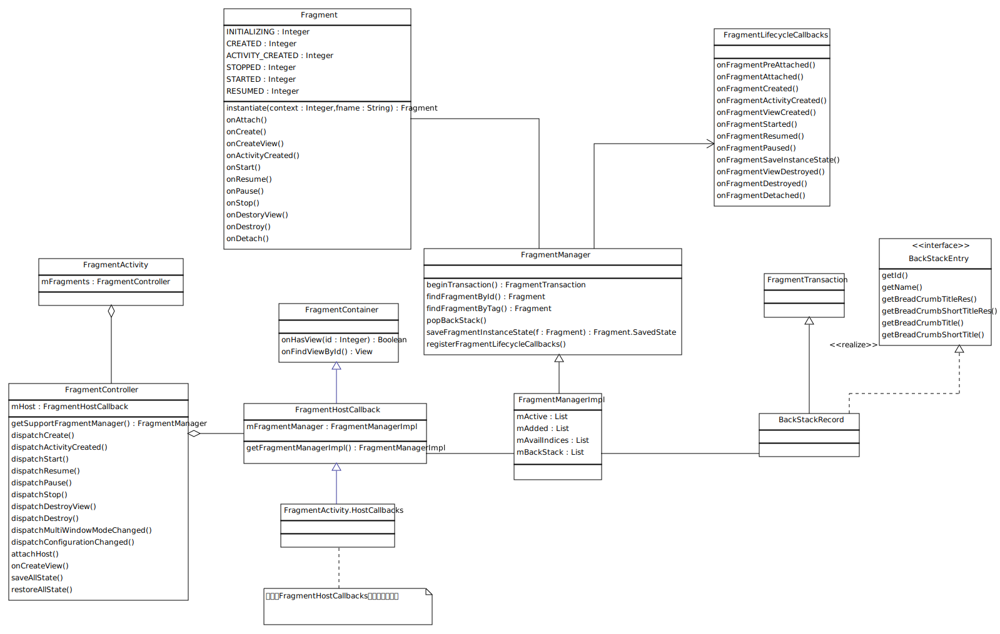
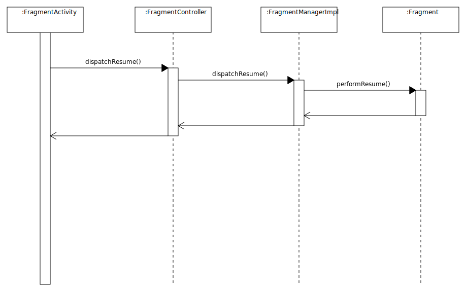
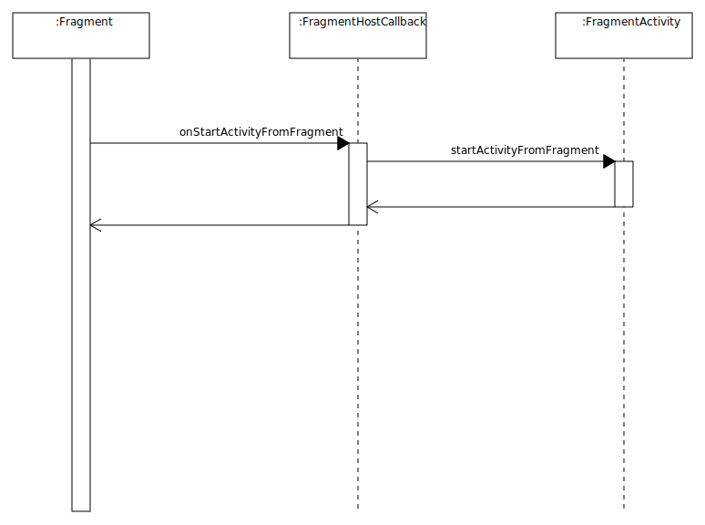

# Fragment源码分析
由于Fragment的独立性和灵活性，在App中拥有广泛的使用。然而，如果使用不当就会造成一些奇怪的BUG发生。本文将对Fragment源码进行分析，从而更好的理解Fragment的使用。由于笔者水平有限，分析的不正确之处还望指出。

## 本文主要分析的内容
- Fragment的使用
- Activity与Fragment之间的关系
- 一次Transaction发生了什么
- Fragment.startActivityForResult过程
- Fragment的恢复机制

## 本文不会涉及到的内容

- Transition
- Fragment与Loader

## Fragment的使用

以下代码片段展示了Fragment的基本使用方式，对于其中的一些特殊处理会在稍后分析。

```Java
public class MainActivity extends FragmentActivity {

    @Override
    protected void onCreate(Bundle savedInstanceState) {
        super.onCreate(savedInstanceState);
        setContentView(R.layout.activity_main);

        //在Activity的恢复过程中，Fragment的恢复将由FragmentManager管理
        //如果不进行判断，直接创建MyFragment并添加到FraggmentManager中界面上将会有两份Fragment
        MyFragment myFragment = (MyFragment) getSupportFragmentManager().findFragmentById(R.id.container);

        if (myFragment == null) {
            myFragment = new MyFragment();
            //myFragment被设置为保留实例，当屏幕发生旋转时，Fragment将不会发生销毁、重建
            myFragment.setRetainInstance(true);
            getSupportFragmentManager()
                    .beginTransaction()
                    .add(R.id.container, myFragment)
                    .commit();
        }
    }

    //Fragment在MainActivity.java中定义时必须声明为静态内部类
    //MyFragment必须拥有无参构造方法
    //在Fragment的恢复部分将会介绍为什么会有这些限制
    public static class MyFragment extends Fragment {
        // ...
    }
}

```

## Activity与Fragment之间的通信



从类图可以看到， FragmentActivity拥有一个名为mFragments的FragmentController, FragmentController内部拥有FragmentHostCallBack。在FragmentHostCallBack中持有了FragmentManager。所有的Fragment都由FragmentManger进行管理。
FragmentHostCallBack可以看做是外部提供Fragment调用的回调方法，在FragmentActivity中，定义了一个FragmentHostCallback的子类HostCallbacks。

### Activity通知Fragment
Activity通过FragmentController通知Fragment，如onResume, onPause。通过onResume的顺序图可以更加清楚的了解他们之间的调用过程。



FragmentActivity.java
```Java
    protected void onResumeFragments() {
        mFragments.dispatchResume();
    }
```
FragmentController.java

```Java        
    public void dispatchResume() {
        mHost.mFragmentManager.dispatchResume();
    }
```
FragmentManagerImpl.java
```Java
    public void dispatchResume() {
        mStateSaved = false;
        mExecutingActions = true;
        moveToState(Fragment.RESUMED, false);
        mExecutingActions = false;
    }
```


### Fragment是如何调用Activity方法的
HostCallbacks完成了Fragment调用Activity。举一个简单的例子，当Fragment调用startActivityForResult时，Fragment通过HostCallbacks最终调用了FragmentActivity的startActivityFromFragment方法。对于7.0只有的权限请求也是相同的原理。下图是三者之间的顺序图。



Fragment.java
```Java
    public void startActivityForResult(Intent intent, int requestCode) {
        startActivityForResult(intent, requestCode, null);
    }

    public void startActivityForResult(Intent intent, int requestCode, @Nullable Bundle options) {
        if (mHost == null) {
            throw new IllegalStateException("Fragment " + this + " not attached to Activity");
        }
        mHost.onStartActivityFromFragment(this /*fragment*/, intent, requestCode, options);
    }

```

HostCallbacks
```Java  
    @Override
    public void onStartActivityFromFragment(Fragment fragment, Intent intent, int requestCode) {
        FragmentActivity.this.startActivityFromFragment(fragment, intent, requestCode);
    }  
    
```

FragmentActivity.java
```Java
    public void startActivityFromFragment(Fragment fragment, Intent intent,
            int requestCode) {
        startActivityFromFragment(fragment, intent, requestCode, null);
    }
        
    public void startActivityFromFragment(Fragment fragment, Intent intent,
            int requestCode, @Nullable Bundle options) {
        mStartedActivityFromFragment = true;

        //1. Activity在启动前会根据fragment生成一个reqeustIndex用于获得结果后可以找到对应的Fragment
        try {
            if (requestCode == -1) {
                ActivityCompat.startActivityForResult(this, intent, -1, options);
                return;
            }
            checkForValidRequestCode(requestCode);
            int requestIndex = allocateRequestIndex(fragment);
            //2. 将requestIndex和request组合成一个新的code进行请求，两个部分各占16位
            ActivityCompat.startActivityForResult(
                    this, intent, ((requestIndex + 1) << 16) + (requestCode & 0xffff), options);
        } finally {
            mStartedActivityFromFragment = false;
        }
    }

    protected void onActivityResult(int requestCode, int resultCode, Intent data) {
        mFragments.noteStateNotSaved();
        
        //1.对reqeustCode进行拆分
        int requestIndex = requestCode>>16;
        if (requestIndex != 0) {
            requestIndex--;
            
            //2.根据requestIndex提取fragment标示
            String who = mPendingFragmentActivityResults.get(requestIndex);
            mPendingFragmentActivityResults.remove(requestIndex);
            if (who == null) {
                Log.w(TAG, "Activity result delivered for unknown Fragment.");
                return;
            }
            //3.查找Fragment并通知结果返回
            Fragment targetFragment = mFragments.findFragmentByWho(who);
            if (targetFragment == null) {
                Log.w(TAG, "Activity result no fragment exists for who: " + who);
            } else {
                targetFragment.onActivityResult(requestCode & 0xffff, resultCode, data);
            }
            return;
        }

        super.onActivityResult(requestCode, resultCode, data);
    }


```

## 一次Transaction发生了什么

```Java
 getSupportFragmentManager()
                    .beginTransaction()
                    .add(R.id.container, myFragment)
                    .commit();

```
通过FragmentManager的Transaction可以添加、移除、显示、隐藏Fragment。 beginTransaction()返回了BackStackRecord对象。 通过阅读BackStackRecord代码，可以看到add(), replace(), hide()等方法最终都调用了doAddOp()方法。在doAddOp()方法中，会将Fragment和FragmentManager进行关联，并创建一个Op对象，并将Op对象加入到数组中。

```Java
 class BackStackRecord extends FragmentTransaction implements
        FragmentManager.BackStackEntry, FragmentManagerImpl.OpGenerator {
  
    final FragmentManagerImpl mManager;

    static final int OP_NULL = 0;
    static final int OP_ADD = 1;
    static final int OP_REPLACE = 2;
    static final int OP_REMOVE = 3;
    static final int OP_HIDE = 4;
    static final int OP_SHOW = 5;
    static final int OP_DETACH = 6;
    static final int OP_ATTACH = 7;

    //Op类定义了对Fragment执行什么样的操作，进入退出动画是怎么样的
    static final class Op {
        int cmd;
        Fragment fragment;
        int enterAnim;
        int exitAnim;
        int popEnterAnim;
        int popExitAnim;
    }

    ArrayList<Op> mOps = new ArrayList<>();
    int mEnterAnim;
    int mExitAnim;
    int mPopEnterAnim;
    int mPopExitAnim;
    int mTransition;
    int mTransitionStyle;
    boolean mAddToBackStack;
    boolean mAllowAddToBackStack = true;
    String mName;
    boolean mCommitted;
    int mIndex = -1;

    public BackStackRecord(FragmentManagerImpl manager) {
        mManager = manager;
    }

    @Override
    public int getId() {
        return mIndex;
    }

    void addOp(Op op) {
        mOps.add(op);
        op.enterAnim = mEnterAnim;
        op.exitAnim = mExitAnim;
        op.popEnterAnim = mPopEnterAnim;
        op.popExitAnim = mPopExitAnim;
    }

    @Override
    public FragmentTransaction add(Fragment fragment, String tag) {
        doAddOp(0, fragment, tag, OP_ADD);
        return this;
    }

    @Override
    public FragmentTransaction add(int containerViewId, Fragment fragment) {
        doAddOp(containerViewId, fragment, null, OP_ADD);
        return this;
    }

    @Override
    public FragmentTransaction add(int containerViewId, Fragment fragment, String tag) {
        doAddOp(containerViewId, fragment, tag, OP_ADD);
        return this;
    }

    private void doAddOp(int containerViewId, Fragment fragment, String tag, int opcmd) {
        final Class fragmentClass = fragment.getClass();
        final int modifiers = fragmentClass.getModifiers();
        
        //添加时，会判断fragment是否是匿名内部类，或者非public，或者非静态
        //不满足要求就会抛出异常
        if (fragmentClass.isAnonymousClass() || !Modifier.isPublic(modifiers)
                || (fragmentClass.isMemberClass() && !Modifier.isStatic(modifiers))) {
            throw new IllegalStateException("Fragment " + fragmentClass.getCanonicalName()
                    + " must be a public static class to be  properly recreated from"
                    + " instance state.");
        }

        fragment.mFragmentManager = mManager;
        
        //必须要给Fragment一个container

        if (containerViewId != 0) {
            if (containerViewId == View.NO_ID) {
                throw new IllegalArgumentException("Can't add fragment "
                        + fragment + " with tag " + tag + " to container view with no id");
            }
            if (fragment.mFragmentId != 0 && fragment.mFragmentId != containerViewId) {
                throw new IllegalStateException("Can't change container ID of fragment "
                        + fragment + ": was " + fragment.mFragmentId
                        + " now " + containerViewId);
            }
            fragment.mContainerId = fragment.mFragmentId = containerViewId;
        }

        Op op = new Op();
        op.cmd = opcmd;
        op.fragment = fragment;
        addOp(op);
    }

    @Override
    public FragmentTransaction replace(int containerViewId, Fragment fragment) {
        return replace(containerViewId, fragment, null);
    }

    @Override
    public FragmentTransaction replace(int containerViewId, Fragment fragment, String tag) {
        if (containerViewId == 0) {
            throw new IllegalArgumentException("Must use non-zero containerViewId");
        }

        doAddOp(containerViewId, fragment, tag, OP_REPLACE);
        return this;
    }

    @Override
    public FragmentTransaction remove(Fragment fragment) {
        Op op = new Op();
        op.cmd = OP_REMOVE;
        op.fragment = fragment;
        addOp(op);

        return this;
    }

    @Override
    public FragmentTransaction hide(Fragment fragment) {
        Op op = new Op();
        op.cmd = OP_HIDE;
        op.fragment = fragment;
        addOp(op);

        return this;
    }

    @Override
    public FragmentTransaction show(Fragment fragment) {
        Op op = new Op();
        op.cmd = OP_SHOW;
        op.fragment = fragment;
        addOp(op);

        return this;
    }

    @Override
    public FragmentTransaction detach(Fragment fragment) {
        Op op = new Op();
        op.cmd = OP_DETACH;
        op.fragment = fragment;
        addOp(op);

        return this;
    }

    @Override
    public FragmentTransaction attach(Fragment fragment) {
        Op op = new Op();
        op.cmd = OP_ATTACH;
        op.fragment = fragment;
        addOp(op);

        return this;
    }

```
设置完动作之后就要进行commit操作了。阅读以下代码可以看到由于BackStackRecord调用了FragmentManager的enqueueAction()方法。

BackStackRecord.java

```Java
    int commitInternal(boolean allowStateLoss) {
    
        mCommitted = true;
        if (mAddToBackStack) {
            mIndex = mManager.allocBackStackIndex(this);
        } else {
            mIndex = -1;
        }
        mManager.enqueueAction(this, allowStateLoss);
        return mIndex;
    }

```

另外，如果想要立刻执行也可以调用commitNow()方法。可以看到，在commitNow中，manager立刻执行了action
```Java
    public void commitNow() {
        disallowAddToBackStack();
        mManager.execSingleAction(this, false);
    }
```

再来看看manager具体是怎么执行action的

```Java


```


## Fragment的恢复机制


## FragmentAdapter是怎么工作的


### 总结
